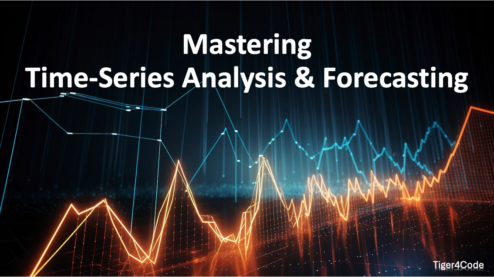

# Mastering Time-Series Analysis & Forecasting

Welcome to the repository for **Mastering Time-Series Analysis & Forecasting**, a YouTube series dedicated to providing in-depth, hands-on tutorials for time-series analysis and forecasting using Python. This repository contains the Jupyter Notebooks for each episode of the series, organized by episode number.

### YouTube Playlist:
The series is available on YouTube (@Tiger4Code). You can watch all episodes in the playlist below:

[Mastering Time-Series Analysis & Forecasting Playlist](https://www.youtube.com/playlist?list=PLVaP8SbYAAitZdhEU_rB-IpXsKSo0OAll)



---

## Repository Structure

This repository is organized by episode number, with each folder containing a Jupyter Notebook that corresponds to the content covered in that episode. Below is an overview of the folder structure:


Mastering-Time-Series-Analysis-and-Forecasting/
```
│
├── Episode_01/
│   ├── episode_01_notebook.ipynb
│   └── additional_resources/
│
├── Episode_02/
│   ├── episode_02_notebook.ipynb
│   └── additional_resources/
│
├── Episode_03/
│   ├── episode_03_notebook.ipynb
│   └── additional_resources/
│
└── ...
```


Each folder is named according to the episode number (e.g., `Episode_01`, `Episode_02`, etc.). Inside each folder, you'll find:
- **episode_X_notebook.ipynb**: The Jupyter Notebook for that episode.
- **additional_resources/**: Any additional resources used or referenced in the episode, such as datasets or helper functions.

---

## Installation

To use the Jupyter Notebooks locally, follow these steps:

1. **Clone the repository**:
    ```bash
    git clone git@github.com:Tiger4Code/Mastering-Timeseries-Analysis-and-Forecasting.git
    ```

2. **Set up a virtual environment** (optional, but recommended):
    ```bash
    python -m venv venv
    source venv/bin/activate  # On Windows, use `venv\Scripts\activate`
    ```

3. **Install dependencies**:
    ```bash
    pip install -r requirements.txt
    ```

4. **Launch Jupyter Notebook**:
    ```bash
    jupyter notebook
    ```

5. Open the corresponding notebook for the episode you want to explore.

---

## License

This project is licensed under the MIT License - see the [LICENSE](LICENSE) file for details.

---

## Acknowledgments

- This series is based on real-world time-series forecasting problems, and we use popular Python libraries like **pandas**, **numpy**, **matplotlib**, **statsmodels**, and **seaborn** throughout the series.
- Special thanks to all the viewers for supporting this learning community.

---

Enjoy learning and mastering time-series analysis and forecasting with Tiger4Code!
